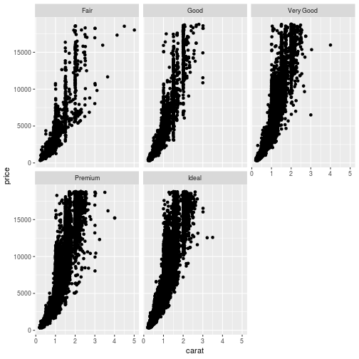

My Data Product presentation - Diamonds
========================================================
author: Jéssica Félix
date: 16/06/2019
autosize: true

Course Project: Shiny Application and Reproducible Pitch
========================================================

This peer assessed assignment has two parts. First, you will create a Shiny application and deploy it on Rstudio's servers. Second, you will use Slidify or Rstudio Presenter to prepare a reproducible pitch presentation about your application.

Try my app [here.]()
See the code in my github page [here.]()
See this presentation in R Markdown [here.]()

Your Shiny Application
========================================================

1. Write a shiny application with associated supporting documentation. The documentation should be thought of as whatever a user will 

2. need to get started using your application.

3. Deploy the application on Rstudio's shiny server

4. Share the application link by pasting it into the provided text box

5. Share your server.R and ui.R code on github

The application must include the following:
========================================================

1. Some form of input (widget: textbox, radio button, checkbox, ...)

2. Some operation on the ui input in sever.R

3. Some reactive output displayed as a result of server calculations

4. You must also include enough documentation so that a novice user could use your application.

5. The documentation should be at the Shiny website itself. Do not post to an external link.


DIAMONDS -  Analyze diamonds by their cut, color, clarity, price, and other attributes
========================================================

This app was create with a classic dataset about diamonds and contains the prices and other attributes of almost 54,000 diamonds.

## Content
**price** - price in US dollars (\$326--\$18,823)

**carat** - weight of the diamond (0.2--5.01)

**cut** - quality of the cut (Fair, Good, Very Good, Premium, Ideal)

**color** - diamond colour, from J (worst) to D (best)

DIAMONDS -  Analyze diamonds by their cut, color, clarity, price, and other attributes
========================================================

**clarity** a measurement of how clear the diamond is (I1 (worst), SI2, SI1, VS2, VS1, VVS2, VVS1, IF (best))

**x** length in mm (0--10.74)

**y** width in mm (0--58.9)

**z** depth in mm (0--31.8)

**depth** total depth percentage = z / mean(x, y) = 2 * z / (x + y) (43--79)

**table** width of top of diamond relative to widest point (43--95)

 Instructions:
========================================================
1. Select a sample size: how many samples do you want to analyze?
2. Select the attributes you would like to compare. 
3. Select the length, the width and the depth of you plot
4. Enjoy ;)

subtittles in the columns
========================================================

**carat** : Carat weight of the diamond

**cut** : Describe cut quality of the diamond. Quality in increasing order Fair, Good, Very Good, Premium, Ideal

**color** : Color of the diamond, with D being the best and J the worst

**clarity** : How obvious inclusions are within the diamond:(in order from best to worst, FL = flawless, I3= level 3 inclusions) FL,IF, VVS1, VVS2, VS1, VS2, SI1, SI2, I1, I2, I3

**depthdepth %** : The height of a diamond, measured from the culet to the table, divided by its average girdle diameter

subtittles in the columns
========================================================

**tabletable%** : The width of the diamond's table expressed as a percentage of its average diameter

**price** : the price of the diamond

**x** : length mm

**y** : width mm

**z** : depth mm

The Dataset - Diamonds
========================================================

A example of what we can find in this dataset, when analyze carat and price of some sample of diamonds: 



Dataset: [Diamonds, from Kaggle](https://www.kaggle.com/shivam2503/diamonds/downloads/diamonds.zip/1)

The Code - ui.R
========================================================

```
library(shiny)
library(ggplot2)
library(markdown)

dataset <- diamonds

fluidPage(theme = "bootstrap.css",
          
          
          headerPanel("DIAMONDS\n"),
          h2("Analyze diamonds by their cut, color, clarity, price, and other attributes\n"),
          h3("Jéssica Félix, june 2019, Coursera Project\n"),
          
          sidebarPanel(
              
              sliderInput('sampleSize', 'Sample Size - instructions in: ', min=1, max=nrow(dataset),
                          value=min(1000, nrow(dataset)), step=500, round=0),
              
              selectInput('x', 'X', names(dataset)),
              selectInput('y', 'Y', names(dataset), names(dataset)[[2]]),
              selectInput('color', 'Color', c('None', names(dataset))),
              
              checkboxInput('jitter', 'Jitter'),
              checkboxInput('smooth', 'Smooth'),
              
              selectInput('facet_row', 'Facet Row', c(None='.', names(dataset))),
              selectInput('facet_col', 'Facet Column', c(None='.', names(dataset)))
          ),
          
          mainPanel(
              plotOutput('plot')
          )

)
```

The Code - server.R
========================================================
```
library(shiny)
library(ggplot2)
library(markdown)

function(input, output) {
    
    dataset <- reactive({
        diamonds[sample(nrow(diamonds), input$sampleSize),]
    })
    
    output$plot <- renderPlot({
        
        p <- ggplot(dataset(), aes_string(x=input$x, y=input$y)) + geom_point()
        
        if (input$color != 'None')
            p <- p + aes_string(color=input$color)
        
        facets <- paste(input$facet_row, '~', input$facet_col)
        if (facets != '. ~ .')
            p <- p + facet_grid(facets)
        
        if (input$jitter)
            p <- p + geom_jitter()
        if (input$smooth)
            p <- p + geom_smooth()
        
        print(p)
        
    }, height=700)
    
}
```

